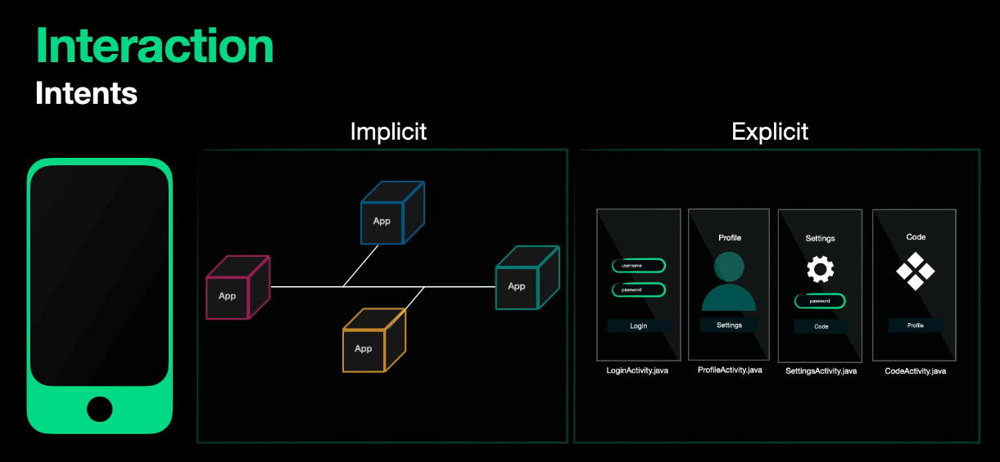

# 1. Activity
- An Activity provides a screen with which users can interact in order to do something. Users can perform operations such as making a call, sending an SMS, etc. Example: Login screen of your Facebook app


## Activities in android manifest file

```manifest
<manifest ... >
  <application ... >
      <activity android:name=".ExampleActivity" />
      ...
  </application ... >
  ...
</manifest >
```

## Activity Lifecycle


# 2. Intent
- An intent in Android is a `messaging object` used to request an action from another app component. It acts as a `bridge between different components` of Android apps, such as `activities`, `services`, and `content providers`.

## Type of Intent



## 1. Explicit Intent 
  - Destination Target Component (a particular `activity` or `service`) are already specify

### Example Code

- Start a New Activity 

```java
  //Explicit Intent by specifying its class name

Intent myIntent = new Intent(FirstActivity.this, SecondActivity.class);

// Start TargetActivity

this.startActivity(myIntent)
```

- Start a new activities with parameters

```java
  //Explicit Intent by specifying its class name

Intent myIntent = new Intent(FirstActivity.this, SecondActivity.class);
myIntent.putExtra("username","admin")//(key,value)

// Start TargetActivity

this.startActivity(myIntent)

```
## 2. Implicit Intents

- `implicit intents` do not directly specify the Android components (destination app or component) which should be called. They declare a `general action to perform`, which allows a component from another app to handle it. 

- For example, an implicit intent can request to take a picture, allowing any app with the appropriate capability to perform the action

### Example code
- For example, to send an email, you can use an implicit intent and let the user choose their preferred email client:

```java
Intent intent = new Intent(Intent.ACTION_SEND);

intent.setType(“message/rfc822”); // MIME type for email

intent.putExtra(Intent.EXTRA_EMAIL, new String[]{“example@example.com”}); // Recipient’s email

intent.putExtra(Intent.EXTRA_SUBJECT, “Hello from Android”); // Email subject

intent.putExtra(Intent.EXTRA_TEXT, “This is an email sent from an Android app.”); // Email body

// Check if there is an app that can handle this intent if 

(intent.resolveActivity(getPackageManager()) != null) { startActivity(Intent.createChooser(intent, “Choose an email client:”)); } else { // Handle the case where no email app is installed }
```

## Intent-Filter

- An Intent Filter is an XML element within the app’s manifest file that describes the types of intents that the components of the app can respond to.
- An intent filter declares the capabilities of a component (such as an activity or service) to handle different kinds of actions or data, allowing it to interact with other components, whether they are part of the same application or not

-The intent filter consists of one or more `action`, `category`, and `data` elements

#### 1. `action`
- Describes the action that the component can perform
- example, an activity may have an intent filter with the action `android.intent.action.VIEW`,"indicating that it can handle view intents to `display specific data`

#### 2. `category`

- Describes the category of the component.
- For example, an activity may declare the `android.intent.category.DEFAULT` category, indicating that it can respond to a default action for the specified data type.

#### 3. `data`

- Describes the data type and schema that the component can handle
- or example, an activity may specify that it can handle `image/*` data type to open and display images.

### Example code

```java
<activity android:name=".ExampleActivity"> 
  <intent-filter> 
    <action android:name="android.intent.action.VIEW" /> 
    <category android:name="android.intent.category.DEFAULT" /> 
    <data android:mimeType="text/plain" /> 
  </intent-filter> 
</activity>
```

 # 3. Deep Link

 

 There are different types of deep links you can create in your Android app: 
 - standard deep links
 - web links, and 
 - Android App Links


# 4. Broadcast receiver

Broadcast Receiver is one of the component in Android that enable apps to listen for and respond to broadcast messages from other apps or the system itself. Think of them as listeners waiting for specific events to occur.

Apps can respond to system-wide events like changes in battery level, network connectivity, and incoming SMS messages by using Broadcast Receivers

## Broadcast message
- The broadcast message is nothing but an Intent. 
- The action string of this Intent identifies the event that occurred (e.g, `android.intent.action.AIRPLANE_MODE` indicates that Airplane mode is toggled). 


There are two types of broadcast receivers: `static` and `dynamic`. 
- `Static` receivers are declared in the app’s `manifest file` and can work even if the app is closed. 
- `Dynamic` receivers are registered in the `app’s code` and only work if the app is active or minimized.

# 5. Content Provider
Content Provider component is providing data from one application to others on request. 
- These requests are handled by the "ContentResolver" class methods. 
- Data might be stored in the system, databases or somewhere else.

# 6. Service 

- A service is simply processing in background while app is running. It is a component that works in the background to perform operations. For instance, service can play music in the background while user is dealing with other apps or can get data from network without any user interaction.